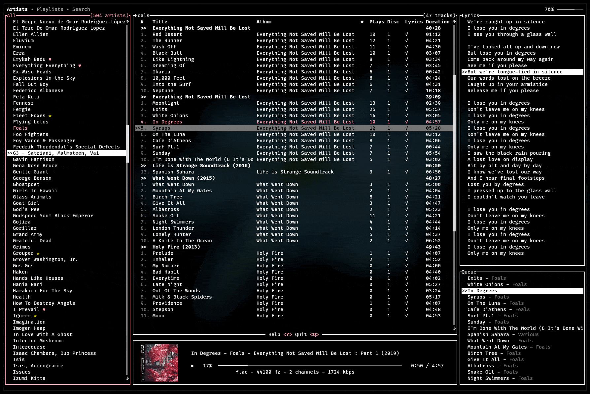
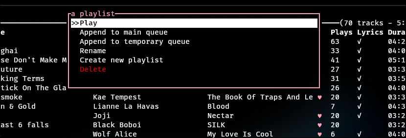
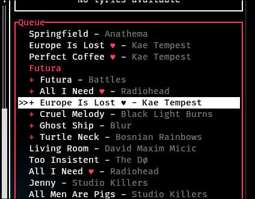
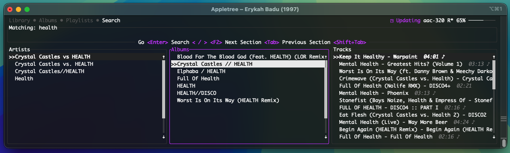

# jellyfin-tui

Jellyfin-tui is a (music) streaming client for the Jellyfin media server. Inspired by CMUS and others,
its goal is to offer a self-hosted, terminal music player with all the modern features you need.

### Features
- stream your music from Jellyfin
- lyrics with autoscroll (Jellyfin > 10.9)
- sixel **cover image**, courtesy of [ratatui-image](https://github.com/benjajaja/ratatui-image)
- transcoding
- spotify-like double queue with order control, etc.
- metadata caching, downloading and a fully **offline mode** (jellyfin-tui --offline)
- last.fm scrobbling, you need [jellyfin-plugin-lastfm](https://github.com/jesseward/jellyfin-plugin-lastfm)
- vim keybindings
- MPRIS controls
- playlists (play/create/edit)
- works over ssh
- fast and just kind of nifty really

### Planned features
- other media types (movies, tv shows)
- jellyfin-wide remote control and much more
- if there is a feature you'd like to see, please open an issue :)

### Screenshots


### Installation
#### Arch Linux
[jellyfin-tui](https://aur.archlinux.org/packages/jellyfin-tui/) is available as a package in the [AUR](https://aur.archlinux.org). You can install it with your preferred [AUR helper](https://wiki.archlinux.org/title/AUR_helpers). Example:
```bash
paru -S jellyfin-tui
```

#### Nix
[jellyfin-tui](https://search.nixos.org/packages?channel=unstable&show=jellyfin-tui&from=0&size=50&sort=relevance&type=packages&query=jellyfin-tui) is available as a package in [Nixpkgs](https://search.nixos.org/packages).

#### Alpine Linux
[jellyfin-tui](https://pkgs.alpinelinux.org/package/edge/community/x86/jellyfin-tui) is available as a package in the Alpine Linux community repository.

#### Other Linux
Jellyfin-tui depends on **libmpv2** (audio playback) and **sqlite3** (offline caching), both of which should be available in your distribution's package manager. On Debian/Ubuntu based systems, you may need to install `libmpv-dev` and `libssl-dev` as well for building.
```bash
# If you're new to rust:
# install rust from https://rustup.rs and make sure ~/.cargo/bin is in your PATH (add this to ~/.bashrc or ~/.zshrc etc.)
export PATH=$PATH:~/.cargo/bin/

# Arch
sudo pacman -S mpv sqlite
# Ubuntu/Debian
sudo apt install mpv libmpv-dev sqlite3 libssl-dev
```
```bash
# clone this repository
git clone https://github.com/dhonus/jellyfin-tui
cd jellyfin-tui

# optional: use latest tag
git fetch --tags
git checkout $(git tag | sort -V | tail -1)

cargo install --path .
```

#### macOS
```bash
brew install mpv
git clone https://github.com/dhonus/jellyfin-tui
cd jellyfin-tui
# add exports to your shell profile (~/.zshrc etc.)
export LIBRARY_PATH="$LIBRARY_PATH:$(brew --prefix)/lib"
export PATH=$PATH:~/.cargo/bin/
cargo install --path .
```

---

### Key bindings
Press **`?`** to see the key bindings at any time. Some of the most important ones are:

<details>
<summary>Key bindings</summary>
<br>

|key|alt|action|
|---|---|---|
|space||play / pause|
|enter||start playing selected|
|up / down|k / j|navigate **up** / **down**|
|tab||cycle between **Artist** & **Track** lists|
|shift + tab||cycle further to **Lyrics** & **Queue**|
|p||show **command prompt**|
|a / A||skip to next / previous **album**, or next in Artists, alphabetically|
|1,2,3,...|F1,F2,F3,...|switch tab >> F1 - **Library**, F2 - **Search**|
|F1|ESC|return to **Library** tab|
|left / right|r / s|seek +/- 5s|
|. / ,|< / >|seek +/- 1m|
|d||download track / album / playlist|
|n||next track|
|N||previous track; if over 5s plays current track from the start|
|+ -||volume up / down|
|ctrl + e|ctrl + enter|play next|
|e|shift + enter|enqueue (play last)|
|E||clear queue|
|DELETE||remove from queue|
|x||stop playback|
|X||reset the program|
|T||toggle transcode (applies to newly added songs, not whole queue)|
|q|^C|quit|

</details>

### Configuration
When you run jellyfin-tui for the first time, it will ask you for the server address, username and password and save them in the configuration file.

The program **prints the config location** when run. On linux, the configuration file is located at `~/.config/jellyfin-tui/config.yaml`. Feel free to edit it manually if needed.
```yaml
servers:
  - name: Main
    url: 'https://jellyfin.example.com'
    username: 'username'
    password: 'imcool123'
    default: true # Add to not ask to pick server. Use --select-server to override
  - name: Second Server
    url: 'http://localhost:8096'
    username: 'username'
    password: 'imcool123'
  - name: Third Server
    url: 'http:/jellyfin.example2.com'
    username: 'username'
    password_file: /home/myusername/.jellyfin-tui-password # use a file containing the password

# All following settings are OPTIONAL. What you see here are the defaults.

# Show album cover image
art: true
# Save and restore the state of the player (queue, volume, etc.)
persist: true
# Grab the primary color from the cover image (false => uses the current theme's `accent` instead)
auto_color: true
# Hex or color name ('green', 'yellow' etc.). If not specified => blue is used.
primary_color: '#7db757'
# Always show the lyrics pane, even if no lyrics are available
always_show_lyrics: true

rounded_corners: true

transcoding:
  bitrate: 320
  # container: mp3

# Discord Rich Presence. Shows your listening status on your Discord profile if Discord is running.
discord: APPLICATION_ID
# Displays album art on your Discord profile if enabled
# !!CAUTION!! - Enabling this will expose the URL of your Jellyfin instance to all Discord users!
discord_art: false

# Customize the title of the terminal window
window_title: true # default -> {title} – {artist} ({year})
# window_title: false # disable
# Custom title: choose from current track's {title} {artist} {album} {year}
# window_title: "\"{title}\" by {artist} ({year}) – jellyfin-tui"

# Options specified here will be passed to mpv - https://mpv.io/manual/master/#options
mpv:
  replaygain: album
  af: lavfi=[loudnorm=I=-16:TP=-3:LRA=4]
  no-config: true
  log-file: /tmp/mpv.log
```
### Theming
<details>
<summary>Click to reveal theming documentation</summary>
<br>

Jellyfin-tui comes with several **built-in themes** in both light and dark variants. You can switch between themes in the **global popup**.

You can also define your own **custom themes** in the config by selecting a **base theme** and *overriding* any colors you want.
Custom themes are hot-reloaded when you save the config file.

##### Color formats
* `"#rrggbb"` (hex)
* `"red"`,`"white"`,`"gray"` (named)
* `"auto"` → uses the extracted accent from album art
* `"none"` → disables optional backgrounds (`background`,`album_header_background` only)

#### Overridable keys
<details>
<summary>Full list of keys</summary>
<br>

| Key | Description                                                                                         |
|-----|-----------------------------------------------------------------------------------------------------|
| `background` | Main background color. Optional — `none` uses terminal bg.                                          |
| `foreground` | Primary text color.                                                                                 |
| `foreground_secondary` | Secondary text (artists in player, ...).                                                            |
| `foreground_dim` | Dimmed text for less important UI elements.                                                         |
| `foreground_disabled` | Disabled or unavailable UI elements, disliked tracks.                                               |
| `section_title` | Titles of sections like *Albums*, *Artists*, etc.                                                   |
| `accent` | Fallback color for `"auto"`, applied when album art isn't available or if `auto_color` is disabled. |
| `border` | Normal border color.                                                                                |
| `border_focused` | Border color when a widget is focused. `"auto"` uses primary (album) color.                         |
| `selected_active_background` | Background of the currently selected row the the active section.                                    |
| `selected_active_foreground` | Text color of the selected row in the active section.                                               |
| `selected_inactive_background` | Background of selected rows in inactive sections.                                                   |
| `selected_inactive_foreground` | Foreground of selected rows in inactive sections.                                                   |
| `scrollbar_thumb` | Scrollbar handle color.                                                                             |
| `scrollbar_track` | Scrollbar track color.                                                                              |
| `progress_fill` | Played/filled portion of progress bars.                                                             |
| `progress_track` | Unfilled portion of progress bars.                                                                  |
| `tab_active_foreground` | Text color of the active tab.                                                                       |
| `tab_inactive_foreground` | Text color of inactive tabs.                                                                        |
| `album_header_background` | Background for album/artist header rows (optional).                                                 |
| `album_header_foreground` | Foreground for album/artist header rows.                                                            |

</details>

#### Example themes

```yaml
themes:
  - name: My Gruvbox Light
    base: Gruvbox Light
    foreground_dim: "#888888"
    selected_active_background: "#e0d9c5"

  - name: "I love cyan"
    base: "Dark"
    foreground: "#ffffff"
    accent: "cyan"
    progress_fill: "auto"
    selected_active_background: 'red'

  - name: "Gruvbox Dark Tweaked"
    base: "Gruvbox Dark"
    border: "Gray"
    selected_active_background: "Indexed(238)"
```

The `"auto"` accent color is derived from album art by default. You can disable this by setting
```yaml
auto_color: false
```
in the config file. This will use the `accent` color defined in the theme instead for all "`"auto"`" usages.

---

</details>

### Popup
There are only so many keys to bind, so some actions are hidden behind a popup. Press `p` to open it and `ESC` to close it. The popup is context sensitive and will show different options depending on where you are in the program.



### Queue
Jellyfin-tui has a double queue similar to Spotify. You can add songs to the queue by pressing `e` or `shift + enter`. Learn more about what you can do with the queue by pressing `?` and reading through the key bindings.



### MPRIS
Jellyfin-tui registers itself as an MPRIS client, so you can control it with any MPRIS controller. For example, `playerctl`.

### Search

In the Artists and Tracks lists you can search by pressing `/` and typing your query. The search is case-insensitive and will filter the results as you type. Pressing `ESC` will clear the search and keep the current item selected.

You can search globally by switching to the Search tab. The search is case-insensitive and will search for artists, albums and tracks. It will pull **everything** without pagination, so it may take a while to load if you have a large library. This was done because jellyfin won't allow me to search for tracks without an artist or album assigned, which this client doesn't support.



### Downloading media / offline mode

Downloading music is very simple, just **press `d` on a track**, or album. More download options can be found in popups.

You can launch jellyfin-tui in offline mode by passing the `--offline` flag. This will disable all network access and only play downloaded tracks.

A local copy of commonly used data is stored in a local database. This speeds up load times and allows you to use the program fully offline. Also, playing a downloaded track will play the local copy instead of streaming it, saving bandwidth.
> Your library is updated **in the background** every 10 minutes. You will be notified if anything changes. Track metadata updates whenever you open a discography/album/playlist view in-place. You can also force an update in the global popup menu. Jellyfin is the parent, if you delete music on the server, jellyfin-tui will also delete it including downloaded files.

### Recommendations
Due to the nature of the project and jellyfin itself, there are some limitations and things to keep in mind:
- jellyfin-tui assumes you correctly tag your music files. Please look at the [jellyfin documentation](https://jellyfin.org/docs/general/server/media/music/) on how to tag your music files. Before assuming the program is broken, verify that they show up correctly in Jellyfin itself.
- **lyrics**: jellyfin-tui will show lyrics if they are available in jellyfin. To scroll automatically with the song, they need to contain timestamps. I recommend using the [LrcLib Jellyfin plugin](https://github.com/jellyfin/jellyfin-plugin-lrclib) and running `Download missing lyrics` directly **within jellyfin-tui** (Global Popup > Run scheduled task > Library: Download missing lyrics), or alternatively the desktop application [LRCGET](https://github.com/tranxuanthang/lrcget), both by by tranxuanthang. If you value their work, consider donating to keep this amazing free service running.

### Supported terminals
Not all terminals have the features needed to cover every aspect of jellyfin-tui. While rare, some terminals lack sixel (or equivalent) support or have certain key event limitations. The following are tested and work well:
- kitty (recommended)
- iTerm2 (recommended)
- ghostty
- contour
- wezterm
- foot

The following have issues
- konsole, alacritty, gnome console, terminator (no sixel support and occasional strange behavior)
