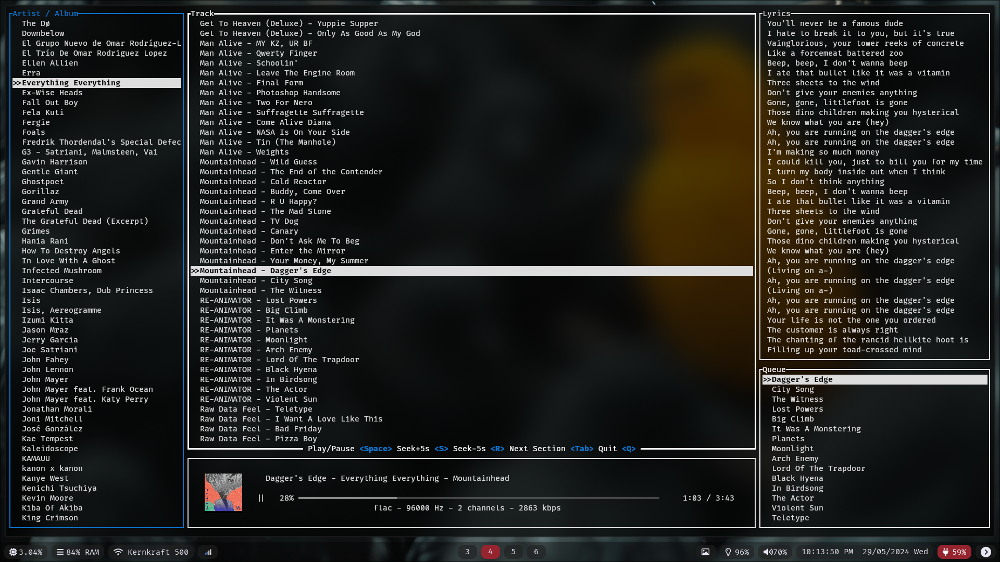
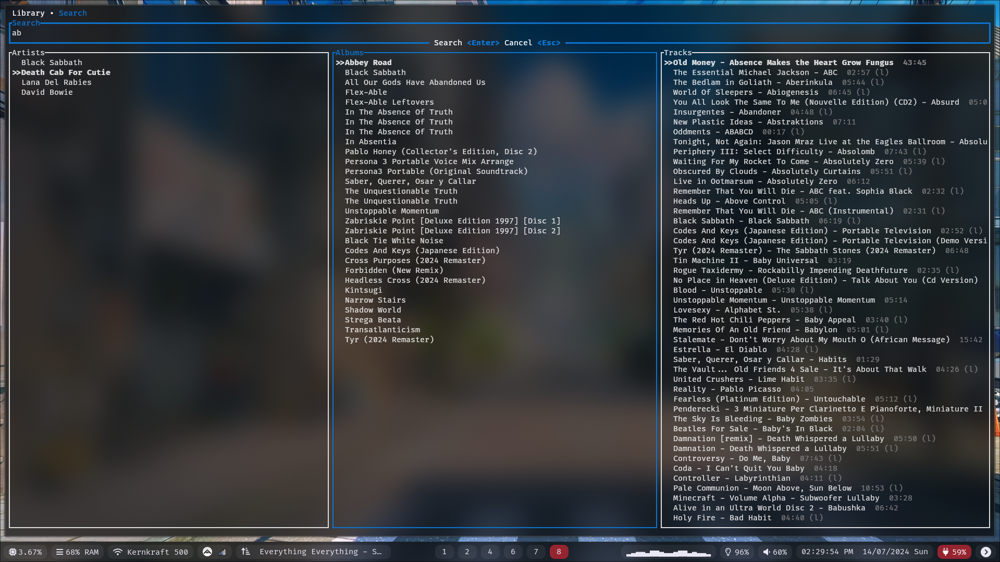

# jellyfin-tui

The goal of this project is a CMUS-like streaming client for Jellyfin with a featureful TUI.

Currently most basic features are implemented. You can browse your library, search for music, play music, and scrobble to last.fm. More features will be added in the future.

The player has a cover image in the corner, this requires the use of a terminal that supports sixel graphics. I will add a fallback for terminals that don't support it in the future. You can find out if your terminal supports sixel [here](https://www.arewesixelyet.com).

I'm enjoying the development of this project, so I'll continue to work on it. I'm open to suggestions and feature requests.

### Features
- streams your music from Jellyfin
- global search
- last.fm scrobbling
- vim keybindings
- sixel cover image
- lyrics (from jellyfin 10.9)
- queue

### Installation
Jellyfin-tui uses libmpv as the backend for audio playback. You need to have mpv installed on your system.

```bash
git clone https://github.com/dhonus/jellyfin-tui
cd jellyfin-tui
cargo run --release
```

### Screenshots


### Configuration
When you run jellyfin-tui for the first time, it will ask you for the server address, username and password and save them in the configuration file.

The configuration file is located at `~/.config/jellyfin-tui/config.yaml`.
```yaml
server: "http://localhost:8096"
password: "password"
username: "username"
```

### Key bindings
|key / alt|action|
|---|---|
|space|play / pause|
|switch tab| F1 - Library, F2 - Search|
|down / j|navigate down|
|up / k|navigate up|
|right / s|skip +5s|
|left / r|skip -5s|
|n|next track|
|p|previous track|
|tab|cycle between Artist & Track|
|shift + tab|focus Queue|
|q|quit|


### Search
You can search globally by pressing `F2` or `/`. The search is case insensitive and will search for artists, albums and tracks. It will pull **everything** without pagination, so it may take a while to load if you have a large library. This was done because jellyfin won't allow me to search for tracks without an artist or album assigned, which this client doesn't support.

