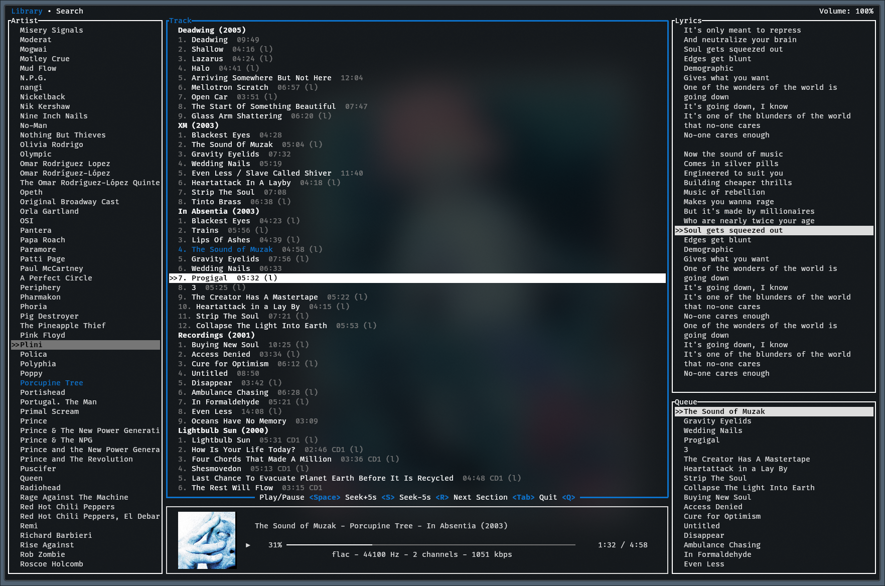

# jellyfin-tui

The goal of this project is a CMUS-like streaming client for Jellyfin with a featureful TUI.

The player has a cover image in the corner, courtesy of the [ratatui-image](https://github.com/benjajaja/ratatui-image) crate. Most modern terminals should support sixel graphics or equivalent.

### Features
- streams your music from Jellyfin
- global/local search
- last.fm scrobbling
- vim keybindings
- sixel cover image
- lyrics (from jellyfin 10.9)
- MPRIS controls
- queue

### Planned features
- playlists (play/create/edit)
- jellyfin-wide remote control
- transcoding
- offline caching
- general overview with recommended albums and favorites

### Screenshots


### Installation
Jellyfin-tui uses libmpv as the backend for audio playback. You need to have mpv installed on your system.

#### Linux
Linux is the main target OS for this project. You can install mpv from your package manager.
```bash
# add ~/.cargo/bin to your PATH (~/.bashrc etc.) if you haven't already
export PATH=$PATH:~/.cargo/bin/

# install mpv
sudo pacman -S mpv # arch
sudo apt install mpv libmpv-dev # ubuntu

# clone and run
git clone https://github.com/dhonus/jellyfin-tui
cd jellyfin-tui
cargo run --release

# or install
cargo install --path .
```

#### macOS
```bash
brew install mpv
git clone https://github.com/dhonus/jellyfin-tui
cd jellyfin-tui
export LIBRARY_PATH="$LIBRARY_PATH:$(brew --prefix)/lib"
export PATH=$PATH:~/.cargo/bin/
cargo install --path .
```

### Configuration
When you run jellyfin-tui for the first time, it will ask you for the server address, username and password and save them in the configuration file.

On linux, the configuration file is located at `~/.config/jellyfin-tui/config.yaml`. Feel free to edit it manually if needed.
```yaml
server: "http://localhost:8096"
password: "password"
username: "username"
```

### Key bindings
|key / alt|action|
|---|---|
|space|play / pause|
|F1 - Library, F2 - Search|switch tab|
|F1, ESC|return to Library|
|down / j|navigate down|
|up / k|navigate up|
|right / s|skip +5s|
|left / r|skip -5s|
|n|next track|
|N|previous track; if over, 5s plays current track from the start|
|tab/hl|cycle between Artist & Track|
|shift + tab/hl|cycle between previous and Lyrics / Queue|
|+|volume up|
|-|volume down|
|q, ^C|quit|

Jellyfin-tui registers itself as an MPRIS client, so you can control it with any MPRIS controller. For example, `playerctl`. Currently, it only supports play/pause, next and previous on linux.

### Search

In the Artists and Tracks lists you can search by pressing '/' and typing your query. The search is case insensitive and will filter the results as you type. Pressing `ESC` will clear the search and keep the current item selected.

You can search globally by pressing `F2`. The search is case insensitive and will search for artists, albums and tracks. It will pull **everything** without pagination, so it may take a while to load if you have a large library. This was done because jellyfin won't allow me to search for tracks without an artist or album assigned, which this client doesn't support.

