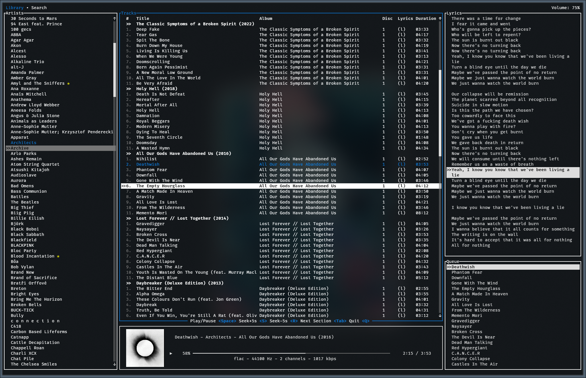

# jellyfin-tui

The goal of this project is a fully featured TUI client for Jellyfin. Inspired by CMUS and others, it's my attempt at creating a usable and feature-rich music player. The player has a cover image in the corner, courtesy of the [ratatui-image](https://github.com/benjajaja/ratatui-image) crate.

Most music players are either entirely terminal based but lack features and require a lot of work to setup; or are GUI based which I find to be slow and obtrusive to my workflow. I also wanted to utilize my jellyfin server as it's what I use for all my media.

### Features
- streams your music from Jellyfin
- lyrics with autoscroll (Jellyfin > 10.9)
- sixel **cover image**
- transcoding
- double queue with order control, etc.
- last.fm scrobbling
- vim keybindings
- MPRIS controls
- playlists (play/create/edit)

### Planned features
- offline caching, jellyfin-wide remote control and much more
- if there is a feature you'd like to see, please open an issue :)

### Screenshots


### Installation
Jellyfin-tui uses libmpv as the backend for audio playback. You need to have mpv installed on your system.

#### Arch Linux
[jellyfin-tui](https://aur.archlinux.org/packages/jellyfin-tui/) is available as a package in the [AUR](https://aur.archlinux.org). You can install it with your preferred [AUR helper](https://wiki.archlinux.org/title/AUR_helpers). Example:
```bash
paru -S jellyfin-tui
```

#### Other Linux
Linux is the main target OS for this project. You can install mpv from your package manager.
```bash
# add ~/.cargo/bin to your PATH (~/.bashrc etc.) if you haven't already
export PATH=$PATH:~/.cargo/bin/

# install mpv
sudo pacman -S mpv # arch
sudo apt install mpv libmpv-dev # ubuntu
```
```bash
# clone this repository
git clone https://github.com/dhonus/jellyfin-tui
cd jellyfin-tui

# checkout the latest stable version if desired
# (git pull and re-run to update)
git checkout $(git tag | tail -1)

cargo run --release

# or install
cargo install --path .
```

#### macOS
```bash
brew install mpv
git clone https://github.com/dhonus/jellyfin-tui
cd jellyfin-tui
export LIBRARY_PATH="$LIBRARY_PATH:$(brew --prefix)/lib"
export PATH=$PATH:~/.cargo/bin/
cargo install --path .
```
### Key bindings
Press **`?`** to see the key bindings at any time. Some of the most important ones are:
|key|alt|action|
|---|---|---|
|space||play / pause|
|enter||start playing selected|
|up / down|k / j|navigate **up** / **down**|
|tab||cycle between **Artist** & **Track** lists|
|shift + tab||cycle further to **Lyrics** & **Queue**|
|p||show **command prompt**|
|a / A||skip to next / previous **album**, or next in Artists, alphabetically|
|F1, F2||switch tab >> F1 - **Library**, F2 - **Search**|
|F1|ESC|return to **Library** tab|
|left / right|r / s|seek +/- 5s|
|n||next track|
|N||previous track; if over 5s plays current track from the start|
|+ -||volume up / down|
|ctrl + e|ctrl + enter|play next|
|e|shift + enter|enqueue (play last)|
|E||clear queue|
|d||remove from queue|
|x||stop playback|
|t||toggle transcode (applies to newly added songs, not whole queue)|
|q|^C|quit|

### Configuration
When you run jellyfin-tui for the first time, it will ask you for the server address, username and password and save them in the configuration file.

The program **prints the config location** when run. On linux, the configuration file is located at `~/.config/jellyfin-tui/config.yaml`. Feel free to edit it manually if needed.
```yaml
# must contain protocol and port
server: 'http://localhost:8096'
username: 'username'
password: 'imcool123'

persist: false # don't restore session on startup
art: false # don't show cover image
auto_color: false # don't grab the primary color from the cover image
primary_color: '#7db757' # hex or color name ('green', 'yellow' etc.)

# options specified here will be passed to mpv - https://mpv.io/manual/master/#options
mpv:
  af: lavfi=[loudnorm=I=-16:TP=-3:LRA=4]
  no-config: true
  log-file: /tmp/mpv.log

transcoding:
  enabled: true
  bitrate: 128
  # container: mp3
```

### MPRIS
Jellyfin-tui registers itself as an MPRIS client, so you can control it with any MPRIS controller. For example, `playerctl`.

### Search

In the Artists and Tracks lists you can search by pressing '/' and typing your query. The search is case insensitive and will filter the results as you type. Pressing `ESC` will clear the search and keep the current item selected.

You can search globally by pressing `F2`. The search is case insensitive and will search for artists, albums and tracks. It will pull **everything** without pagination, so it may take a while to load if you have a large library. This was done because jellyfin won't allow me to search for tracks without an artist or album assigned, which this client doesn't support.


### Known issues
Due to the nature of the project and jellyfin itself, there are some limitations and issues:
- jellyfin-tui assumes you correctly tag your music files. Please look at the [jellyfin documentation](https://jellyfin.org/docs/general/server/media/music/) on how to tag your music files. Before assuming the program is broken, verify that they show up correctly in Jellyfin itself.
- if your **cover image** has a black area at the bottom, it is because it's not a perfect square. Please crop your images to a square aspect ratio for the best results.

### Supported terminals
Not all terminals have the features needed to cover every aspect of jellyfin-tui. While rare, some terminals lack sixel (or equivalent), such as  image support or have certain key event limitations. The following are tested and work well:
- kitty (recommended)
- iTerm2 (recommended)
- ghostty
- wezterm
- konsole

The following have issues
- alacritty, gnome console, terminator (no sixel support and occasional strange behavior)
